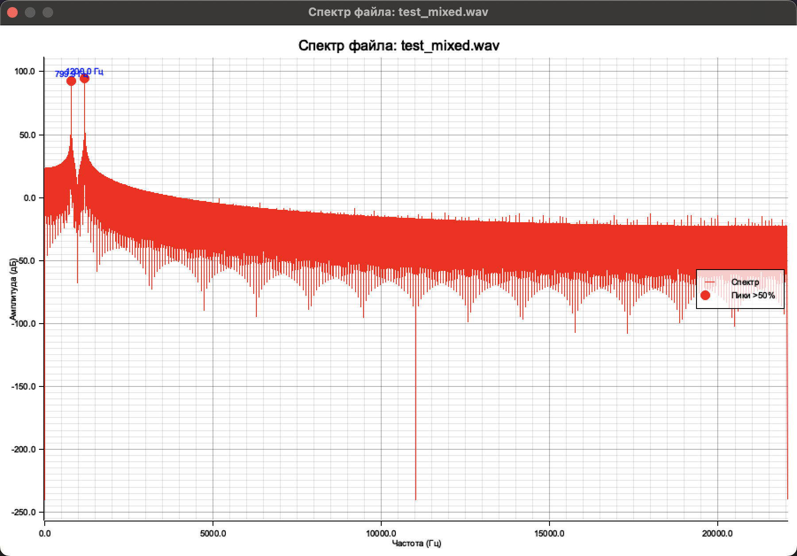
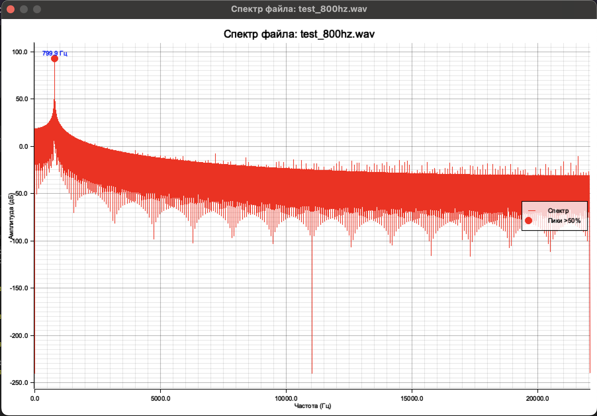
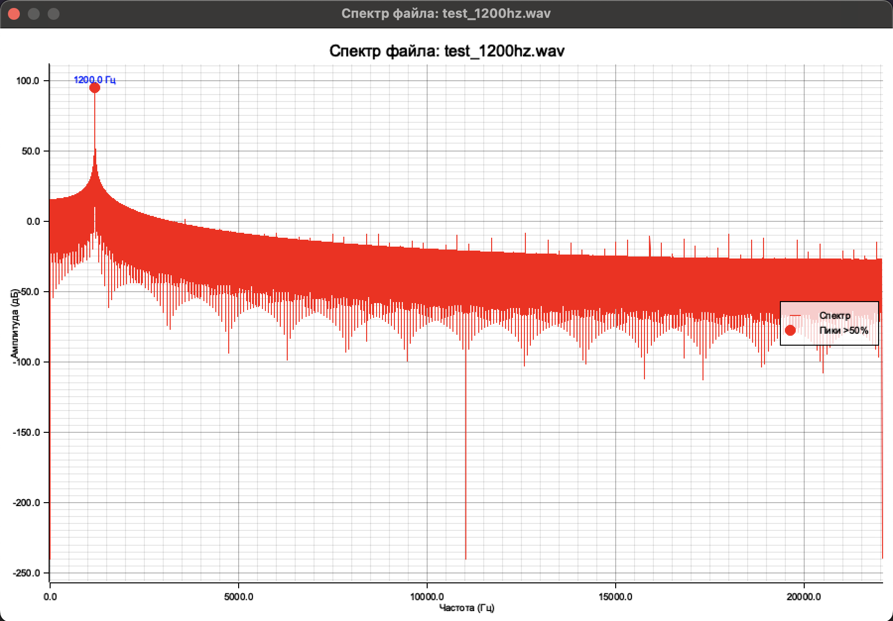

# Audio File Spectrum Analyzer






A Rust program for displaying the spectral characteristics of WAV files (16‑bit PCM). It plots the amplitude spectrum in decibels, detects peaks with levels above 50% of the maximum, and provides a brief description of each detected frequency (fundamental tone, harmonics, etc.).

## Features
- Reads mono and stereo 16‑bit PCM WAV files.
- Computes a one-sided spectrum using FFT (Fast Fourier Transform).
- Displays the plot in a separate window (close with `Esc`).
- Automatically detects spectrum peaks exceeding 50% of the maximum amplitude.
- Classifies peaks: fundamental tone, harmonics (up to the 5th, then generic), low/mid/high-frequency components.
- Prints detailed information about each peak to the console.

## Requirements
- macOS (the program uses `minifb` for window creation; it also works on Linux and Windows with minor adjustments).
- Rust and Cargo (install from [rustup.rs](https://rustup.rs/)).
- WAV files with the following parameters: 16‑bit, PCM (uncompressed), any number of channels (will be converted to mono).

## Building

1. Clone the repository or create a new Cargo project:
   ```bash
   cargo new spectrum_analyzer
   cd spectrum_analyzer

